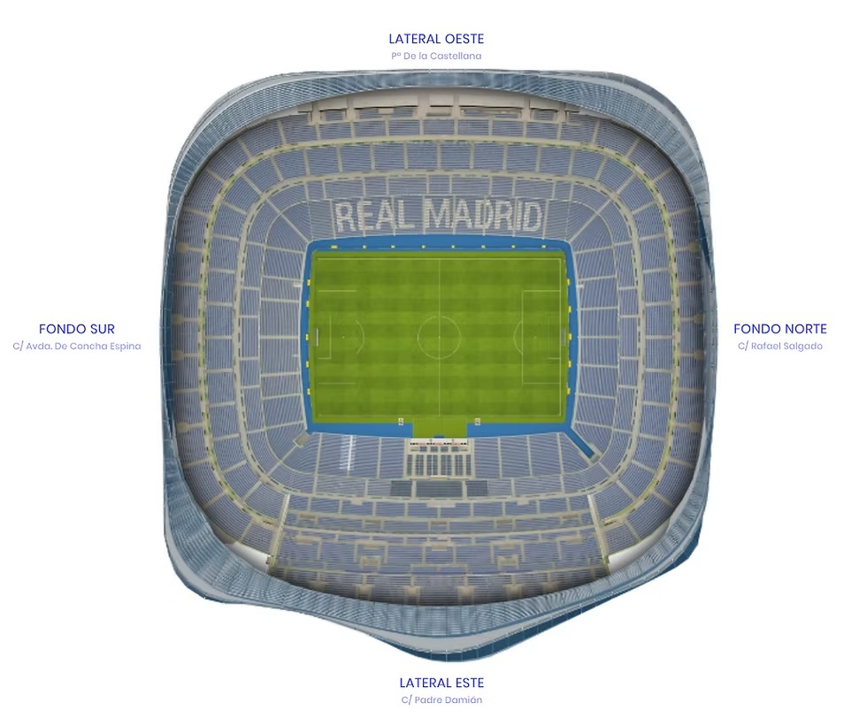

# Santiago Bernabéu BESS Financial & Energy Dashboard

A bankable valuation and energy optimization platform designed to evaluate utility-scale Battery Energy Storage Systems (BESS) across different architectural zones and operating scenarios at the Santiago Bernabéu stadium.

🌐 **Live Demo:** [View Streamlit Dashboard](https://bernabeu-bess-optimizer-bib7uw2scelgkqsagdwcmn.streamlit.app/)  
📂 **GitHub Repository:** [Mohammadrezarefaei/bernabeu-bess-optimizer](https://github.com/Mohammadrezarefaei/bernabeu-bess-optimizer/tree/main)

---

## Stadium Layout & Zone Mapping



---

## Key Features & Architecture

| Component / Module | Technology Stack | Primary Function |
| :--- | :--- | :--- |
| **Zone Profiling** | Python, Pandas | Models power demand across distinct stadium stands using custom load multipliers. |
| **Optimization Engine** | NumPy, Custom Logic | Solves daily power dispatch vectors for peak shaving and grid strain reduction. |
| **Financial Modeling** | Custom Python Backend | Evaluates a 70/30 debt-to-equity structure, CAPEX, bank debt, equity, and DSCR. |
| **Interactive UI** | Streamlit, Matplotlib | Provides a dark-themed UI with dynamic sliders and automated 24-hour curves. |
---
Installation & Local Execution
Clone the repository:

Bash
git clone [https://github.com/Mohammadrezarefaei/bernabeu-bess-optimizer.git](https://github.com/Mohammadrezarefaei/bernabeu-bess-optimizer.git)
cd bernabeu-bess-optimizer
Install dependencies:

Bash
pip install -r requirements.txt
Run the Streamlit application:

Bash
streamlit run app.py
---

## Project Structure

```text
bernabeu-bess-optimizer/
│
├── data/                    # Market and parameter configuration files
│   └── market_params.json   # Base electricity pricing and demand charges
├── models/                  # Core calculation and optimization engines
│   ├── __init__.py
│   ├── financials.py        # CAPEX, debt/equity, and DSCR calculations
│   └── optimizer.py         # Peak shaving and BESS dispatch logic
├── utils/                   # Helper modules and scenario generators
│   ├── __init__.py
│   └── scenarios.py         # Stadium load profile generators (Match Day, Concert, etc.)
├── app.py                   # Main Streamlit dashboard application
├── bernabeu_layout.png      # Stadium zone mapping visual asset
├── requirements.txt         # Required Python packages
└── README.md                # Project documentation
